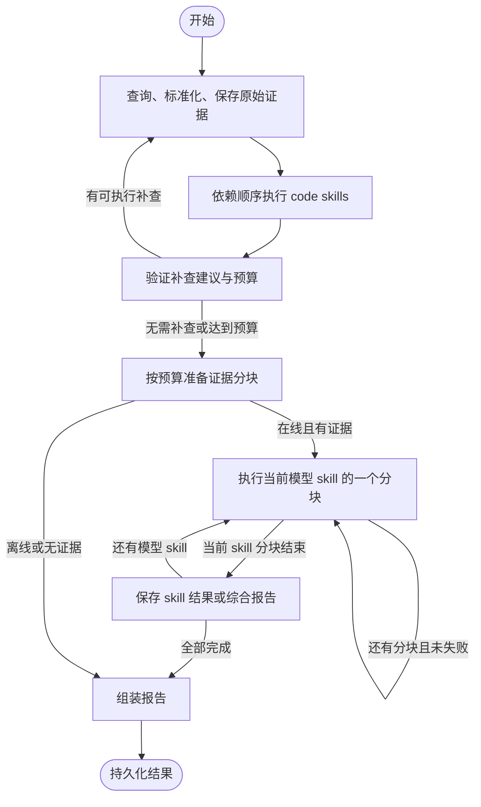

# 架构与扩展说明

本次重构把流程控制交给 LangGraph，把模型调用和解析交给 LangChain。HTTP 接口、`.env` 配置和 `skill.yaml` / `prompt.md` 格式保持兼容。

## 从哪里开始阅读

1. `backend/troubleshooter/bootstrap.py`：创建依赖。只在这里选择 Splunk 或 Replay 数据源。
2. `api/agent.py` → `investigation/tasks.py`：接收请求，排队，启动或取消任务。
3. `investigation/service.py`：为每笔交易创建独立状态、预算和模型客户端，执行图并保存结果。
4. `investigation/graph.py`：查看完整执行顺序与循环条件。
5. `investigation/evidence.py`、`followups.py`、`model_steps.py`：各阶段的业务实现。
6. `models/client.py`：模型调用、输出解析、有限修复与实际用量统计。

前端从 `frontend/src/app/App.tsx` 阅读：它负责布局和组合组件。表单输入在 `InvestigationForm`，任务生命周期在 `useInvestigation`，证据读取及过期请求保护在 `useEvidence`。

## 状态图



`graph.py` 使用真实 `StateGraph`、条件边和节点状态更新，不把旧执行器包成单一节点。每个 code skill 都生成一个图节点。任务返回的 `steps` 记录已经完成的节点名称，便于排查执行过程。

`InvestigationState` 只携带业务数据：证据、查询历史、skill 产物、当前分块、诊断与限制。密钥、SDK 客户端、数据库连接不进入图状态。每次运行创建独立预算；模型修复和证据展开同样消耗调用预算，SDK 自动重试关闭。`LLM_MAX_OUTPUT_TOKENS` 同时覆盖供应商计入输出的推理 token；输入预算会扣除预留的输出空间。长度截断会返回明确限制，不尝试把残缺 JSON 解释成完整报告。

## 模型与 skill 的边界

- `ChatPromptTemplate` 将系统规则、可信 skill 提示词与不可信日志材料分开。
- `init_chat_model` 创建 OpenAI 兼容模型客户端，支持现有 `LLM_BASE_URL` 和 `LLM_MODEL` 配置。
- `PydanticOutputParser` 验证 JSON 结构，再校验证据 ID；最多修复一次。这是应用层验证，不依赖供应商支持原生结构化输出或 tool calling。
- `ModelSteps` 执行现有 `read_evidence` 能力；`FollowupPlanner` 接受补查建议，由代码校验 ID 来源、环境、时间窗和预算。
- skills 仍是产品级 manifest + prompt。代码处理器通过注册表执行；图提供编排。修改自然语言不会改变确定性规则。

公司日志不应因为环境中的 LangSmith 配置自动上传，因此排查运行显式关闭 LangSmith tracing。图节点状态保存在当前任务内存中，任务和原始证据保存到 PostgreSQL（JSONB）。**未启用 LangGraph checkpoint 或断点续跑**；进程重启后的未完成任务仍按原有方式标为中断。

## 使用的设计方式

| 方式 | 使用位置 | 解决的问题 |
| --- | --- | --- |
| 适配器 | `LogSource`、`JsonModel` | 替换数据源/模型不影响排查规则 |
| 策略注册表 | `analysis.HANDLERS`、`SkillRegistry` | 通过配置选择可信处理器并校验依赖 |
| 依赖注入 | `bootstrap.py`、服务构造函数 | 将组装和执行分开，测试可替换外部依赖 |
| 显式状态图 | `investigation/graph.py` | 查询循环、分块循环和终止条件一处可见 |
| 纯函数 | 规则分析、报告生成、补查校验 | 相同输入可复现，便于单独阅读与验证 |

## 常见修改

- 新日志字段：修改 `config/settings.yaml`；需要新解析逻辑时修改 `logs/normalization.py`。
- 新清洗规则：修改 `logs/cleaning.py`。清洗只控制模型材料大小，不改变 PostgreSQL 中的原始证据。
- 新业务解释：增加 `skills/<name>/skill.yaml` 和 `prompt.md`，配置 workflow 与依赖。
- 新确定性规则：在 `analysis/` 新建业务模块，在 `analysis/__init__.py` 的 `HANDLERS` 注册。
- 新补查条件：修改 `investigation/followups.py`，保持请求范围与预算校验。
- 新数据源：实现 `logs/sources/base.py` 的 `LogSource` 契约，在 `bootstrap.py` 组装。
- 新执行阶段：添加返回状态更新的节点，再修改 `graph.py` 的边；不要在 HTTP 路由里编排流程。

## 升级运行

存储入口是 `persistence/postgres.py`，通过 psycopg 参数化查询与事务保存任务/证据；外键级联删除过期证据。数据库切换没有改变单 worker 调度模型。

Python 依赖按 `backend/requirements.lock` 锁定，包含 LangChain、LangGraph 和 OpenAI 适配器。执行 `./scripts/dev.sh` 会更新已有虚拟环境；容器使用 `docker compose up --build`。当前使用 PostgreSQL。旧 SQLite 数据需通过 `persistence/migrate_sqlite.py` 导入，保留原任务 ID；连接与迁移步骤见 README。

手动运行服务时入口改为：

```bash
.venv/bin/uvicorn troubleshooter.api.agent:create_app --factory --host 127.0.0.1 --port 8001
.venv/bin/uvicorn troubleshooter.api.public:create_app --factory --host 127.0.0.1 --port 8000
```

原先的扁平 Python 模块已移除；自定义脚本如直接导入 `engine`、`agent_api` 或 `llm`，需改用上面的新模块路径。HTTP 调用与 YAML skill 配置无需变更。

## 可读性与日志约定

- 主流程使用提前返回/continue 处理空数据和无效分支，避免多层条件嵌套。
- 前端 `ReportPanel` 只组合标题、进度和报告；`report/ReportContent` 选择标签页，`DiagnosisView` 与 `ExecutionDetails` 分别负责诊断和执行数据。`InvestigationSettings` 只处理设置编辑。
- 中文注释解释约束和原因，例如“显式父子关系有歧义时不能降级猜测”“迟到的证据响应不能重新打开抽屉”，不逐句翻译显然的代码操作。
- 后端通过 `observability/logging.py` 的 `log_event` 记录事件；使用固定事件名和允许的元数据字段，禁止传入业务正文。`task_context` 自动跨异步调用关联任务 ID。
- 高频成功访问不记录；阶段细节使用 DEBUG，故障包含错误类型、文件名、行号和方法名。默认 INFO 保持一次任务的日志数量有限。
